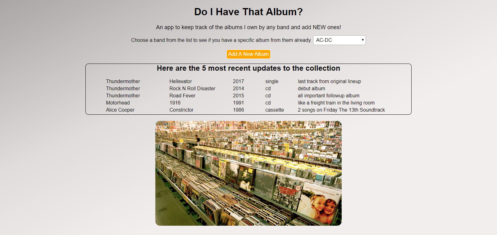
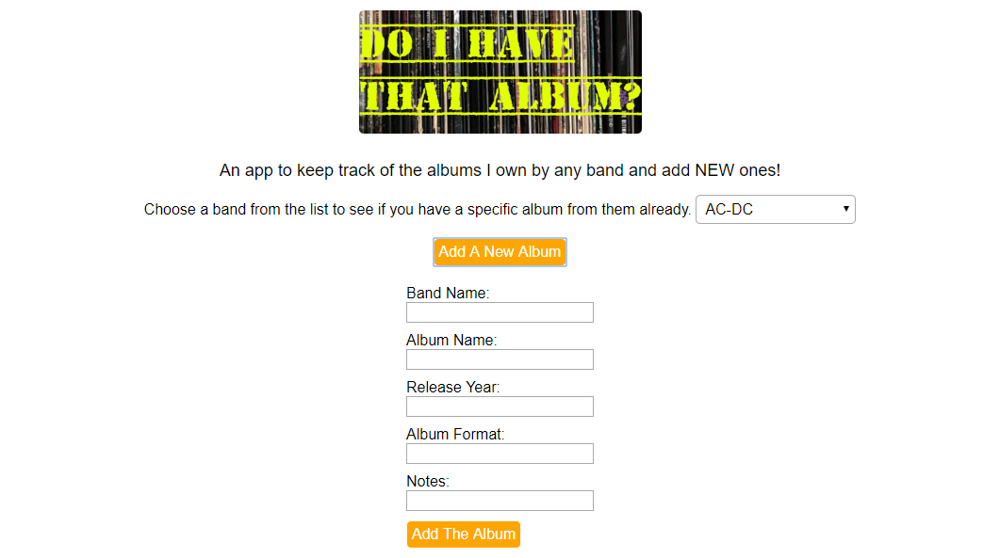
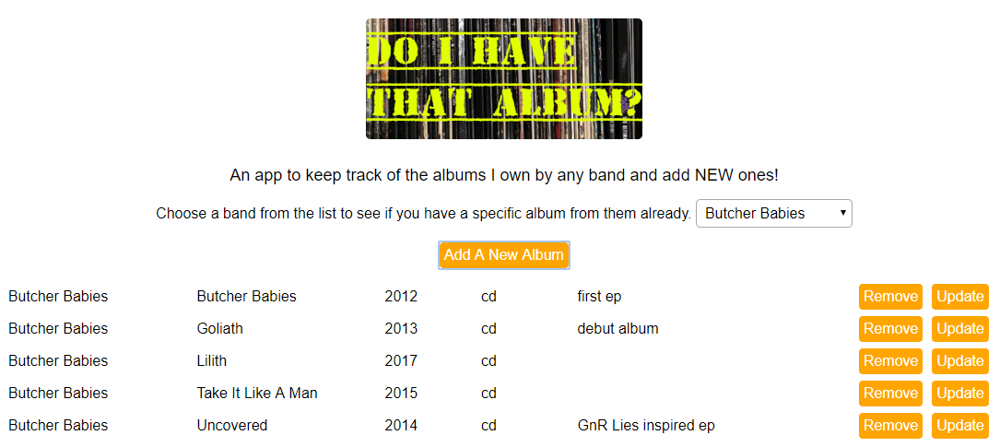
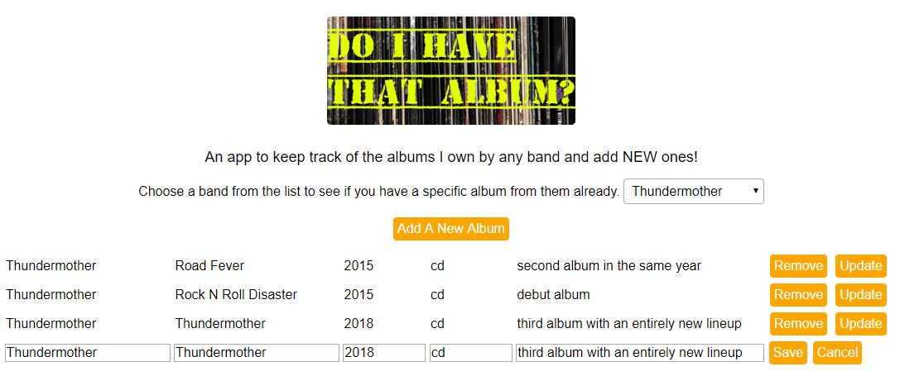

# Do I Have That Album
This app serves to provide an easy way to determine if I have a particular album in my music collection as not all of my music is digitized and hence not on my phone. The landing page features that last 5 additions to the collection and a dropdown list of the name of every band that has an entry. Choosing a band from the list will bring back all of the albums I have from the selected group, alphabetically by album title, since that is the level of detail I'm looking to have at my fingertips. I can add, remove, or update details about the albums as needed.

## Demo
[Live Demo] (https://fast-wildwood-34655.herokuapp.com)

## Screenshots
Landing Page 

Add An Album

Band Selected

Update An album

## Built With/Using
- Chai
- Express
- Heroku
- jQuery
- mLab
- Mocha
- Mongoose
- Morgan
- Node
- Travis CI
